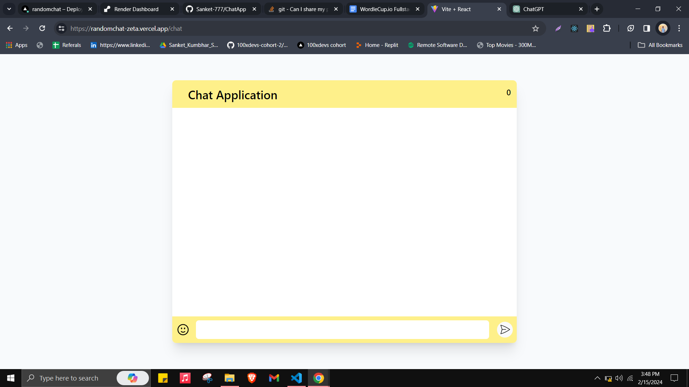

# Real-Time Chat Application

This is a real-time chat application built with Node.js, Socket.IO, and React. It allows users to join chat rooms and communicate with each other in real-time.

## Features

- **Real-time Communication:** Messages are delivered instantly to all connected clients.
- **Multiple-User Chat Rooms:** Users can join different chat rooms and communicate with other users within those rooms.
- **User Notifications:** Notifications are displayed for new user joining and user leaving the chat room.
- **Emoji Support:** The user can use emoji's to express their feeling.

## Technologies Used

- **Backend:**

  - Node.js
  - Socket.IO
  - HTTP Server

- **Frontend:**
  - React
  - Socket.IO Client
  - React Toastify (for notifications)

## Deployment

The backend server is deployed on Render, and the frontend is deployed separately on Vercel

- **Backend Deployment:** [Link to Backend Deployment](https://chatapp-backend-mxxy.onrender.com)
- **Frontend Deployment:** [Link to Frontend Deployment](https://randomchat-zeta.vercel.app/)

## Getting Started

To run the application locally, follow these steps:

1. Clone this repository.
2. Navigate to the `backend` directory and run `npm install` to install dependencies.
3. Start the backend server by running `node index.js`.
4. Navigate to the `frontend` directory and run `npm install` to install frontend dependencies.
5. Start the frontend development server by running `npm run dev`.

## Contributing

Contributions are welcome! If you'd like to contribute to this project, please follow these steps:

1. Fork the repository.
2. Create a new branch (`git checkout -b feature/my-feature`).
3. Make your changes.
4. Commit your changes (`git commit -am 'Add new feature'`).
5. Push to the branch (`git push origin feature/my-feature`).
6. Create a new Pull Request.

## Frontend ScreenShots

